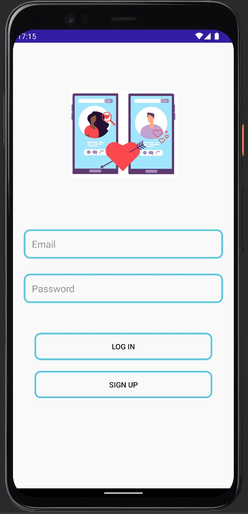
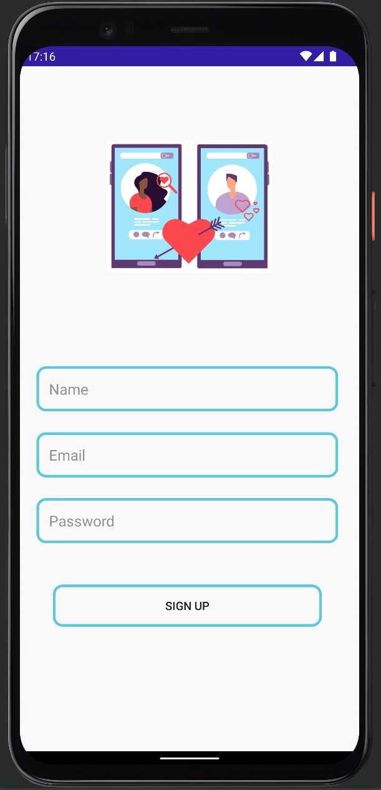
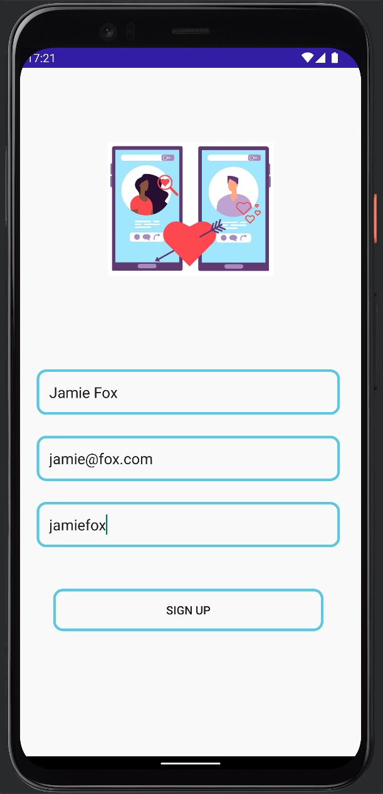
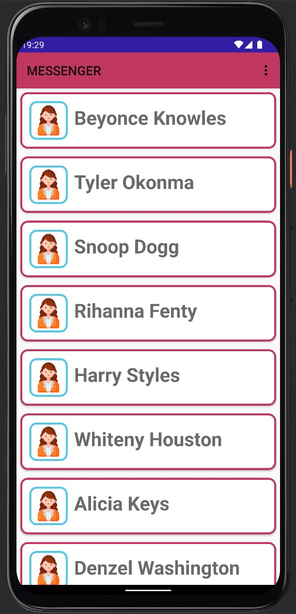
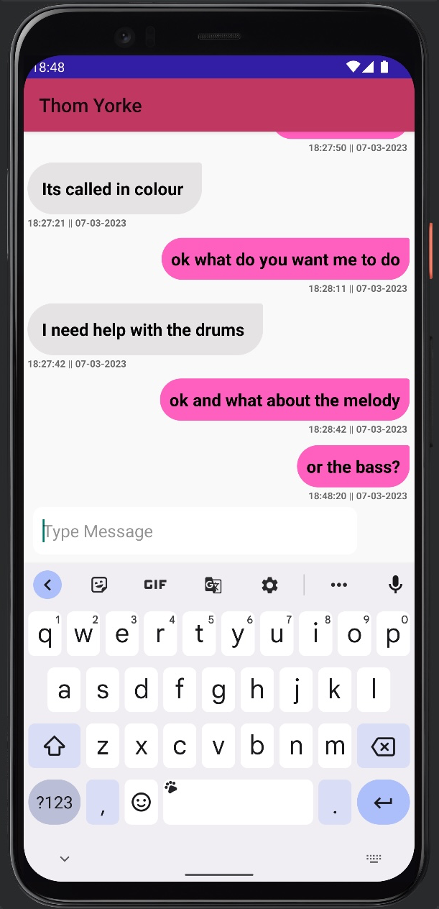

# Messenger Chat App 

Messenger Chat App is an app built with Kotlin and Firebase that displays messages
in real-time using Firebase realtime database 

* Users can sign up for an account by clicking the Sign in button.
* Email Authentication using Firebase to Register and Sign in users
* Signed In Users can Log In
* The User has the ability to Send and Receive Messages.
* Sign Out using Menu bar

  
  Firebase
  Realtime Database- Flexible, scalable NoSQL cloud database to store and sync data.
  Firebase cloud Storage - For Store and serve user-generated content.
  Authentication - For Creating account with mobile number.

## Screenshots

## Video Walk Through
Show cases:

* User Sign Up
* User Login
* Chat List
* User Sending and Receiving Messages
* User Logout

https://user-images.githubusercontent.com/86728005/223570159-cfd75348-1701-4404-9b95-7872ed1f8558.mp4

https://user-images.githubusercontent.com/86728005/223570652-12e7323e-e9be-47d7-8f6b-7a48eaf46d08.mp4

https://user-images.githubusercontent.com/86728005/223570679-327ff57a-0ac1-4a11-8348-6ee2f7eb7565.mp4

https://user-images.githubusercontent.com/86728005/223570764-2e689961-9b44-45b8-bc81-5bbbfa0c1d6a.mp4

